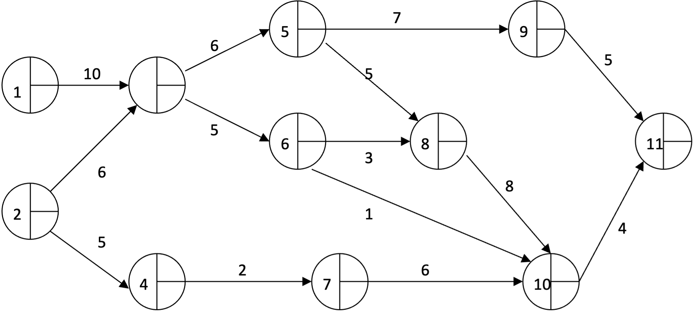
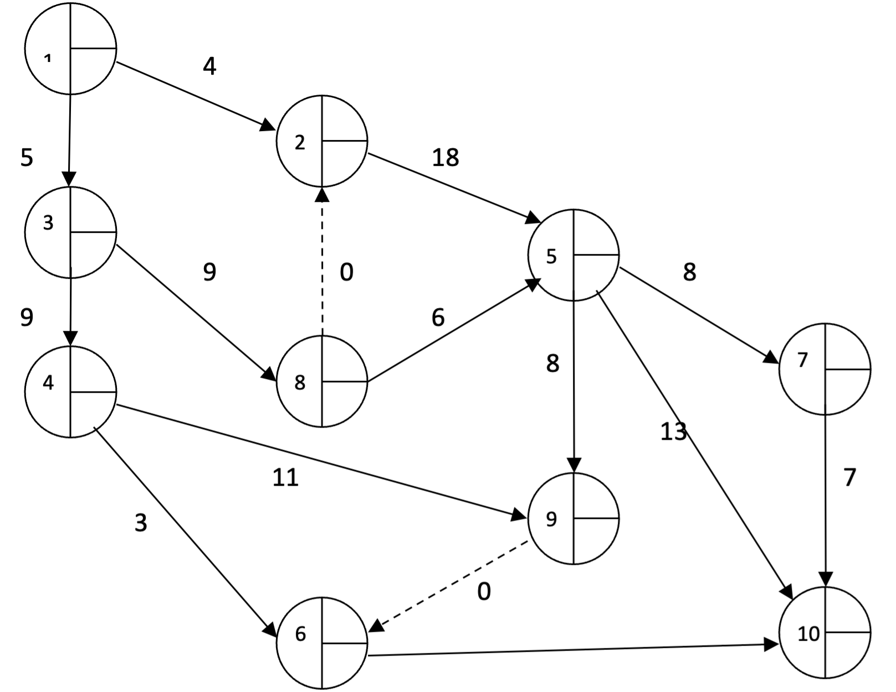

# Projectplanning


#### Hogeschool PXL
##### **PXL-Digital** Professionele bachelor in de toegepaste informatica

##### **42TIN1250 Projectmanagement**

##### **Lectoren**
##### Dhr. Lowie Vangaal, Dhr. Jan Castermans

<div style="page-break-after: always;"></div>

## Inleiding


> [!note] Definitie
> Projectplanning is het organiseren van alle aspecten van een project.

Aspecten waar een projectplanning op kan zien zijn bijvoorbeeld:

- Volgen van het project **scope statement (PSS)**
- **Fasering**: Uit welke fasen bestaat het project (bijvoorbeeld: analysefase, uitvoeringsfase, implementatiefase, evaluatiefase)? Wat gebeurt er in elke fase? (PRINCE 2)
- **Tijd**: Wanneer moet elke fase afgerond zijn? Wanneer moet het project af zijn? Hoeveel speelruimte is er per fase? Hoeveel speelruimte is er voor het hele project? Wat is het kritieke pad?
- **Geld**: Welk budget is er? Welk budget is er nodig? Wanneer is het geld nodig? Wat zijn de verwachte opbrengsten?
- **Informatie**: Hoe wordt gerapporteerd over de voortgang van het project en over eventuele knelpunten? Wanneer wordt gerapporteerd?

Om het project goed te kunnen plannen kan gebruik gemaakt worden van programmatuur voor projectplanning.

## PERT


> [!note] Definitie
> PERT (Program Evaluation and Review Technique) is een hulpmiddel voor de bedrijfsleiding bij de analyse en planning van projecten. Hierbij wordt gebruik gemaakt van een grafische voorstelling, het netwerk, om de samenhang tussen de verschillende werkzaamheden aan te geven. [[@schegget.hamelink_1993]]

Projecten zijn opgebouwd uit een aantal activiteiten. Sommige activiteiten dienen achter elkaar te worden uitgevoerd, andere mogen gelijktijdig worden uitgevoerd. Meestal is het zo dat de duur van het project globaal genomen afhankelijk is van een aantal op elkaar aansluitende activiteiten. Indien de tijd voorzien voor de uitvoering van deze activiteiten kan ingekort worden, kan heel het project vroeger klaar zijn. Van andere activiteiten mag de uitvoeringstijd variëren zonder de duur van het project te beïnvloeden.

Belangrijke voordelen van netwerkplanning zijn:

- Goede voortgangscontrole
- Verbetering van de communicatie via het netwerk
- Het opsporen van bottlenecks

> [!INFO] Geschiedenis
> De PERT methode is uitgevonden door de United States Department of Defense's US Navy Special Projects Office in 1958 als een onderdeel van het Polaris project. De PERT methode lijkt sterk op de kritieke pad methode. Bij de kritische pad methode wordt uitgegaan van de gesommeerde duur van het kritieke pad, terwijl in de PERT methode een kansberekening wordt toegepast.*


### Hoofdbegrippen
#### Knooppunt
- Gebeurtenis
- Aanvang of einde van een taak, werkzaamheid of bewerking
- Neemt geen tijd, arbeid of grondstoffen in beslag
- Voorgesteld door een cirkel


#### Activiteit 

- Uitvoering van een taak
- Er zijn mensen, materialen, hulpmiddelen en tijd voor nodig
- Voorgesteld door een pijl met willekeurige lengte tussen twee knooppunten


#### Netwerk:

- Brengt de logische opeenvolging van de activiteiten in beeld
- Welke activiteiten gaan vooraf of volgen of verlopen simultaan


#### Schijnactiviteit

- Een technisch noodzakelijke wachttijd veroorzaakt door een natuurlijk proces of een noodzakelijke wachttijd veroorzaakt door afspraken met derden
- Neemt alleen tijd, geen mankracht of hulpmiddelen in beslag


#### Relatielijn (of 0-lijn)

- Geeft een noodzakelijk verband aan
- Neemt geen tijd in beslag, geen mankracht en geen hulpmiddelen
- Voorgesteld met een stippellijn tussen twee knooppunten met een 0
- Handige oplossing voor tekenproblemen


#### Afstemmingslijn

- Geeft een gewenst verband weer
- Voorgesteld door een stippellijn met een A

### Tijdsfactor

Eens het netwerk opgesteld moet men bepalen hoeveel tijd elk van de activiteiten in beslag neemt. 

Voor het berekenen van de verwachte tijd van een activiteit gebruiken we drie schattingen:

1. t$_o$ = optimistische schatting (most optimistic time)
2. t$_l$ = gemiddelde schatting (most likely time)
3. t$_p$ = pessimistische schatting (most pessimistic time)

> [!important] ten slotte
t$_e$ = verwachte tijd (*expected time*) $$t_e= \frac{(t_o+ 4t_l + t_p)}{6}$$

### Verwachte tijdstippen

Eens alle activiteiten en knooppunten getekend zijn, gaan we het netwerk analyseren.

*T$_E$ = Earliest expected time*

In de voorwaartse gang berekenen we het vroegst mogelijke begin. Dit is het vroegst mogelijke tijdstip waarop een bepaald knooppunt kan bereikt worden, en meteen ook het vroegste begin van de activiteiten die vertrekken in dit knooppunt.

Voor elk pad (aaneenschakeling van activiteiten) dat in een bepaald knooppunt toekomt berekenen wij de som van de TE’s van de activiteiten op dat pad. De grootste som wordt de TE van het beschouwde knooppunt.

*T$_L$ = Latest allowable time*

In de achterwaartse gang berekenen we het laatst toelaatbare eindtijdstip. Als een activiteit niet voltooid is op dit tijdstip wordt de globale duur van het project overschreden.

De T$_L$ wordt bepaald door de berekening te beginnen vanaf het laatste knooppunt van het project. De T$_L$ van een bepaald knooppunt is dan gelijk aan de T$_L$ van het volgende knooppunt, min de te van de activiteit die de twee knooppunten verbindt. Als er in een bepaald knooppunt verscheidene activiteiten vertrekken, dan maken wij de berekening langs de verschillende paden en gebruiken het kleinste getal als T$_L$ van het beschouwd knooppunt.

### Speling

Speling of “slack” is de maximale vertraging die een bepaalde activiteit mag oplopen, zonder dat een vertraging voor het hele project ontstaat.

$${Slack} = T_L – T_E – t_e$$

De speling kan zowel positief, nul als negatief zijn:

| positieve speling                                                                                  | geen speling                                            | negatieve speling                                                                                                         |
| -------------------------------------------------------------------------------------------------- | ------------------------------------------------------- | ------------------------------------------------------------------------------------------------------------------------- |
| de start van deze activiteit kan uitgesteld worden                                                 | bij deze activiteit geen vertraging mag optreden        | de uitvoering van de activiteit moet worden versneld indien we het project binnen de gestelde tijdsduur willen beëindigen |
| de uitvoering van deze activiteit mag vertraagd worden door minder mensen en middelen in te zetten | de juiste hoeveelheid mankracht en materiaal is ingezet | meer mensen en middelen moeten ingezet worden                                                                             |
|                                                                                                    |                                                         |                                                                                                                           |


### Kritieke pad

In het netwerk lopen verscheidene paden van de aanvangsfase naar de eindfase. Het pad dat de grootste tijdsduur vraagt om te doorlopen is het kritieke pad (Critical Path). Een vertraging op dit pad heeft een vertraging van heel het project tot gevolg.

De CPM-techniek is een methode om die activiteiten te bepalen en te coördineren, die uitgevoerd worden om vastgestelde doeleinden te bereiken binnen een voorgeschreven tijd.

Indien de T$_L$ en de T$_E$ van het hele project aan elkaar gelijk gesteld worden, is de speling op het kritieke pad overal gelijk aan 0.

### Oefeningen

#### Oefening 1

1. Bepaal de doorlooptijd
2. Duid het kritieke pad aan

#### Oefening 2

1. Bepaal de doorlooptijd
2. Duid het kritieke pad aan

#### Oefening 3

De volgende activiteiten kwamen van pas toen een farao een piramide wenste te bouwen. Hij gebruikte drie raadgevers (architecten) die hem een schatting gaven van de vermoedelijke tijdsduur van de activiteiten. De Nubiër Aboe Simpel schatte erg optimistisch. De Babyloniër Catastrofix voorzag het ergste. De Egyptenaar Constuxes had al ervaring en gaf zijn erg gewaardeerde mening te kennen.

| act. | beschrijving                                                           | voorafgaand | optimistische tijd (jaren)(t<sub>o</sub>) | pessimistische tijd (jaren)(t<sub>p</sub>) | realistische tijd (jaren)(t<sub>l</sub>) |
| ---- | ---------------------------------------------------------------------- | ----------- | ----------------------------------------- | ------------------------------------------ | ---------------------------------------- |
| A    | Maak de plannen                                                        | /           | 1                                         | 3                                          | 2                                        |
| B    | Vang voldoende dienaren                                                | /           | 3                                         | 3                                          | 3                                        |
| C    | Hak en transporteer voldoende rotsen voor de beelden en de fundamenten | A, B        | 8                                         | 14                                         | 8                                        |
| D    | Leid voldoende “dienaren” op als beeldhouwers                          | B           | 2                                         | 4                                          | 3                                        |
| E    | Beeldhouw de figuren van de farao                                      | C,D         | 8                                         | 12                                         | 10                                       |
| F    | Leg de fundamenten                                                     | C           | 5                                         | 15                                         | 10                                       |
| G    | Verplaats het beeld naar de voet van de piramide                       | E,F         | 3                                         | 7                                          | 5                                        |
| H    | Vorm nu met de rotsblokken de piramide                                 | G           | 27                                        | 43                                         | 32                                       |


1. Stel de activiteiten voor als een netwerk.
2. Bepaal het kritieke pad.

#### Oefening 4

Een automatiseringsproject bij het bedrijf "YouShallNotPass" omvat 14 activiteiten :

1. Het uitvoeren van de projectanalyse (act1) moet zijn gebeurd voordat de andere activiteiten kunnen starten. (10 weken)

2. Na de projectanalyse kan men beginnen met :
	- de probleemanalyse van de backend (act 2; 10 weken)
	- de probleemanalyse van de frontend (act 3; 5 weken)
	- het aanvragen van offertes voor de computerinstallatie (act 4; 5 weken)
	- werving en selectie van personeel (act 5; 10 weken)

3. Na voltooiing van act 2 kan men beginnen met :
	- de bouw van de backend (act 6; 30 weken)
	- de invoeringsvoorbereiding van de backend (act 7;20 weken)

4. Na voltooiing van act 3 kan men beginnen met :
	- de bouw van de frontend (act 8; 30 weken)
	- de invoeringsvoorbereiding van de frontend (act 9; 20 weken)

5. Na voltooiing van act 4 kan men beginnen met act 10 : de computerkeuze, gevolgd door de levering van de computer. (45 weken)

6. Nadat de computer geleverd is en act 5 is voltooid, kan men act 11 uitvoeren : de installatie van de computer .(5 weken)

7. Na voltooiing van de activiteiten 6, 7, 11 kan men beginnen met act 12 : de invoering van de backend. (10 weken)

8. Na voltooiing van de activiteiten 8, 9, 11 kan men beginnen met de act 13 : de invoering van de frontend. (10 weken)

9. Na invoering van de backend en frontend kan men act 14 starten : de integratie van de Backend en frontend. (10 weken)

**Gevraagd**

1. Teken het netwerk en duidt het kritieke pad aan.
2. Vermeld in het netwerk de nummers van de activiteiten, T$_E$ en T$_L$ bij elk knooppunt en de speling bij de activiteiten.
3. Werk in MS Project een Gantt-chart uit en ken aan de 6 personeelsleden de taken toe zoals beschreven op de volgende bladzijde, bij overbelasting een oplossing zoeken!


**Aanvullende informatie automatiseringsproject bij het bedrijf "** **YouShallNotPass ".**

Aan het project werken 6 medewerkers mee en ze staan in voor de volgende taken :

-   Aerts L.
    -   Analyse
    -   Aanvragen van offertes
    -   Computerkeuze + levering
    -   Installatie computer
    -   Integratie backend en frontend


-   Janssens G.
    -   probleemanalyse backend
    -   computerkeuze + levering

-   Peeters J.
    -   werving + selectie personeel

-   Cuppens M.
    -   probleemanalyse backend en frontend
    -   bouw backend
    -   invoeringsvoorbereiding backend
    -   invoering backend

-   Goelen K.
    -   probleemanalyse frontend
    -   bouw subsysteem frontend
    -   invoeringsvoorbereiding frontend
    -   installatie computer
    -   invoering frontend

-   Maex R.
    -   invoering backend en frontend
    -   integratie backend en frontend

#### Extra oefening 5 (wordt niet uitgewerkt in de lessen, enkel het resultaat)

Het bedrijf WalkerWhite wil een applicatie maken voor smartphones over de serie Game of Thrones. De televisiezender HBO heeft voorlopig de goedkeuring gegeven aan het bedrijf indien zij de voorgestelde deadline halen.

Voor de ontwikkeling van de app heeft het bedrijf een kosten-batenanalyse uitgewerkt. De resources en tijd zijn echter beperkt.

Op vraag van de zender stelt het bedrijf een planning op om een overzicht te krijgen van de verwachte opleverdatum. 3 projectmanagers van WalkerWhite gaan na de laatste meeting met HBO samen naar de lokale McDonald’s om een PERT-planning op te stellen.


| Activiteit: Beschrijving     | Voorgaand | Junior ProjMgr Optimistic | Senior ProjMgr Most Likely | Junior ProjMgr Pessimistic |
| ---------------------------- | --------- | ------------------------- | -------------------------- | -------------------------- |
| Act 1: Analyse DevOps        | /         | 2                         | 6                          | 4                          |
| Act 2: Servers opzetten      | 1         | 2                         | 3                          | 4                          |
| Act 3: Dev omgeving opzetten | 1         | 1                         | 5                          | 3                          |
| Act 4: Uitwerken mockup’s    | 1         | 2                         | 8                          | 8                          |
| Act 5: DevOps finetunen      | 2,3       | 1                         | 2                          | 3                          |
| Act 6: Verwerken feedback    | 4         | 2                         | 3                          | 10                         |
| Act 7: Ontwikkeling iOS      | 5         | 3                         | 4                          | 5                          |
| Act 8: Ontwikkeling Android  | 5         | 6                         | 7                          | 8                          |
| Act 9: SW naar live-omgeving | 6         | 2                         | 9                          | 10                         |
| Act 10: Testen software      | 4         | 10                        | 20                         | 30                         |
| Act 11: Regressietesten      | 7,8,9     | 3                         | 10                         | 11                         |
| Act 12: Afwerking/oplevering | 10,11     | 6                         | 15                         | 18                         |
> [!remark] Opmerking
> Ingeschatte duur per projectmanager in **dagen**


**Gevraagd:**

- Werk een PERT-planning uit voor de applicatie: iGame of Thrones
- Bereken de verwachte tijd (t$_e$). Solution: 47 dagen
- Bepaal het kritieke pad. Solution : Act 1 – 4 – 6 – 9 – 11 – 12

## Gantt-grafiek

Een Gantt-grafiek (Engels: Gantt-chart) is een grafiek ofwel diagram die gebruikt kan worden als hulpmiddel bij projectmanagement.

### Gantt-chart = tijdschaal voorstelling

In een “tijdschaal voorstelling” worden de activiteiten op verschillende horizontale lijnen voorgesteld als stroken. In het diagram ligt een tijdschaal. De activiteiten worden gerangschikt in stijgende volgorde van eindknooppuntnummer en daarbinnen in stijgende volgorde van beginknooppuntnummer. Elke strook wordt getekend tussen de T$_E$ en de T$_L$ van een activiteit.

Deze voorstelling respecteert de algemene regels voor de tijdschaal voorstelling, maar laat eveneens toe:

- relaties te leggen tussen de activiteiten
- de vereiste hulpmiddelen aan te geven
- de voortgang aan te duiden

De relaties tussen de activiteiten worden verduidelijkt door het nummer van het beginknooppunt vooraan en het nummer van het eindknooppunt achteraan boven de strook te schrijven. Bovendien wordt er een stippellijn getrokken door overeenkomstige eind- en beginknooppunten.

Een schuine stippellijn duidt op het feit dat er een speling bestaat. Een verticale stippellijn duidt op de afwezigheid van de speling. Om het “kritieke pad” te volgen vertrekt men van het eindknooppunt van het netwerk en gaat men in de tijd terug langs de stroken en de uitsluitend verticale stippellijnen tot men de tijd “0” bereikt.

Onder elke activiteit kan de werkelijke voortgang van de werken aangeduid worden door een gearceerde strook. Op die manier kan er gecontroleerd worden of alle activiteiten nog binnen het vooropgestelde schema zitten of niet.

> [!info] Geschiedenis
Henry Laurence Gantt ontwikkelde in 1917 de Gantt-grafiek. In zijn werk als mechanisch engineer, management consultant en industry advisor werd de Gantt-grafiek gebruikt als een visueel hulpmiddel om de planning en voortgang van een project te laten zien. Op dit moment is het een wereldwijd geaccepteerde standaard, destijds een opzienbarende innovatie. De Gantt-grafiek werd onder andere gebruikt bij grote bouwprojecten als de Hoover Dam in 1931 en het interstate highway network in 1956.

### Lay-out

Een Gantt-grafiek bestaat uit een aantal rijen die ieder een module of taak binnen het project vertegenwoordigen. Meestal staan de eerste modules bovenaan. Op de horizontale as staat de tijd die nodig is voor het totale project. Per project wordt middels een tijdbalk aangegeven welke tijd per module nodig is.

Gecompliceerdere Gantt-grafieken kunnen ook zaken bevatten als milestones en relaties tussen modules (bijvoorbeeld: taak 1 moet afgerond zijn voor taak 3 gestart kan worden).


De blauwe balken zijn taken die uitgevoerd moeten worden. De pijlen geven condities aan: een taak die eerst volbracht moet zijn voordat aan de volgende begonnen kan worden. De zwarte ruiten zijn milestones: ijkpunten waarop een bepaalde toestand gereed moet zijn.

### Hulpprogramma's

Er zijn verschillende programma's die gebruikt kunnen worden voor het maken van een Gantt-grafiek. Voor een simpel figuurtje volstaat het om een spreadsheet bepaalde cellen te kleuren. Voor geavanceerdere figuren kunnen programma's als het gratis Open Source Gantt-project, Microsoft Visio, Microsoft Project of de gebruikelijke projectmanagementpakketten gebruikt worden.

### Toewijzing van hulpmiddelen

Aan elke activiteit kunnen we bepaalde hulpmiddelen toekennen (vb. computers, mensen, …).

Onder de bestaande “Gantt chart” wordt een extra diagram voorzien waarin we de inzet van de nodige hulpmiddelen in een staafdiagram tekenen. Voor elk nodig hulpmiddel kan zo een apart staafdiagram opgezet worden.

Over- en onderbezettingen kunnen vervolgens weggewerkt worden, m.a.w. het gebruik van hulpmiddelen kan gespreid worden, door de activiteiten te verschuiven voor zover hun speling dit toelaat. Indien de capaciteit nog steeds overschreden is, na het spreiden van activiteiten, zijn er twee mogelijkheden:

-   Ofwel gaat men de doorlooptijd behouden en gaat men extra kosten doen om de capaciteit te verhogen (extra computers aankopen, externe mensen inhuren, …);
-   Ofwel mag men geen bijkomende kosten doen, zodat de speling voor sommige activiteiten wordt overschreden en de einddatum van het project uitgesteld wordt.

### Projectkosten

De projectkosten worden veroorzaakt door het gebruik (mensen, computers, …) of verbruik (papier, elektriciteit, …) van hulpmiddelen. Deze kosten worden per activiteit berekend. Voorlopig gaan we hier niet verder op in.

### Voortgangscontrole

Dit is het moeilijkste deel van projectbeheer. Vooral bij software ontwikkeling is de vooruitgang van de werken moeilijk te controleren. Het is niet voldoende de hoeveelheid werk (aantal instructies) of de gepresteerde tijd op te volgen, men moet ook regelmatig de kwaliteit nagaan. Een slecht ontworpen of geschreven programma zal eventueel moeten herschreven worden, wat de geschatte tijd in aanzienlijke mate kan overschrijden.

Een goede methode is samen met de programmeur en op basis van ervaringen met gelijkaardige programma’s regelmatig het percentage van het werk te schatten dat voltooid is. Dit percentage houdt rekening met de hoeveelheid en de moeilijkheidsgraad van het voltooide en nog te presteren werk. Dit percentage wordt op een “Gantt chart” uitgebeeld als een gearceerde strook boven de strook die de geschatte duurtijd voorstelt van de handeling. De verhouding van de lengtes van de stroken geeft het voltooiingpercentage aan.

Op regelmatige tijdstippen wordt een planning gehouden en men stelt dan vast dat de werken gelijk, vooruit of achteruit lopen op de geplande tijden. In het laatste geval (en dit is het meest voorkomende) kan men twee dingen doen:

-   Terugkoppelen
    -   men gaat de werken versnellen door de productiviteit van de hulpmiddelen (personeel, computers, …) te verhogen of door hun aantal te vermeerderen, om toch nog de geschatte duurtijd te respecteren.

-   Vooruitkoppelen
    -   men gaat op basis van de werkelijke productie, de geschatte tijden herzien en een nieuwe planning uitwerken.

Gewoonlijk worden beide acties samen ondernomen. Het meest moeilijke deel is dan de nieuwe tijden en kosten aan de directie en de klant mee te delen.

In het geval dat de werken vooruit lopen (de droom van iedere projectleider), kan men eveneens terugkoppelen door hulpmiddelen vrij te maken voor andere handelingen en vooruitkoppelen door de geschatte tijden te verminderen.

### Oefening blokhut

#### Opgave week 3/4

##### Taken en taakniveaus

We willen een blokhut plaatsen in de tuin. De blokhut hebben we gekocht als een bouwpakket. De bouwelementen zullen voorhanden zijn vanaf de leveringsdatum: dinsdag 12 oktober 2021.

Materialen die eveneens aangekocht werden, zijn zand, kiezelstenen en cement. De blokhut zal gebouwd worden met drie personen, ze zullen beginnen te bouwen op de dag van de levering.

De volgende taken zullen uitgevoerd moeten worden

| Nr. | Naam taak                              | Duur | Voorafgaand |
| --- | -------------------------------------- | ---- | ----------- |
| 1   | **Bouw van een blokhut**               |      |             |
| 2   | *Voorbereiding*                        |      |             |
| 3   | Onderdelen uitpakken en controleren    | 1,5h |             |
| 4   | Plan bespreken met werklieden          | 1h   | 3           |
| 5   | *Fundering*                            |      |             |
| 6   | Uitgraven fundering                    | 4h   | 4           |
| 7   | Plaatsen bekisting                     | 1h   | 6           |
| 8   | Beton storten                          | 2h   | 7           |
| 9   | Uitharden beton                        | 1d   | 8           |
| 10  | Verwijderen bekisting                  | 0,5h | 9           |
| 11  | *Wanden*                               |      |             |
| 12  | Basislaag planken plaatsen             | 1h   | 10          |
| 13  | Overige planken plaatsen               | 2h   | 12          |
| 14  | Blokhut verankeren op fundering        | 0,5h | 13          |
| 15  | *Dak*                                  |      |             |
| 16  | Daknok- en latten bevestigen           | 2h   | 14          |
| 17  | Houten platen leggen op het dak        | 1h   | 16          |
| 18  | Roofing op lengte snijden              | 0,5h | 17          |
| 19  | Roofing bevestigen op platen           | 2h   | 18          |
| 20  | *Afwerking*                            |      |             |
| 21  | Vensters klaarmaken                    | 1h   | 4           |
| 22  | Deur klaarmaken (slot, scharnieren, …) | 1h   | 4           |
| 23  | Ramen en deur plaatsen                 | 1h   | 19;21;22    |
| 24  | Vloeren in de blokhut                  | 1h   | 19          |
| 25  | Blokhut vernissen                      | 5h   | 19          |
| 26  | Gazon rondom bijwerken                 | 4h   | 23;24;25    |
| 27  | *Oplevering*                           |      |             |
| 28  | Schoonmaken                            | 1h   | 26          |
| 29  | Eindcontrole voor oplevering           | 0,5h | 28          |


-   Creëer een nieuw projectplan.
-   Geef de projectgegevens in.
-   De vaste startdatum is voorzien op `dinsdag 12 oktober 2021`.
-   De titel van het project, extra informatie, de naam van de auteur en de manager mag je zelf bepalen.
-   Nu moeten de taken voorzien worden van hun geschatte tijdsduur (t$_e$) en ook de taakafhankelijkheden moeten aangebracht worden:

    -   Zorg eerst voor een goede uitlijning van de taakniveaus (hoofd- en subtaken).
    -   Geef de duur, de eigenschappen en de afhankelijkheden van elke taak in.  
        **Let op:** taak 4 en taak 29 zijn taken van “vaste duur/fixed duration”.
    -   Bij nader inzien is taak 9 geen echte taak, maar wel een wachttijd. Men kan pas 1 dag na het einde van taak 8 starten met taak 10. Taak 9 kan dus verwijderd worden en taak 10 start met een vertraging van 1 dag. De nummers van de taken zijn nu natuurlijk wel gewijzigd.

    -   Om een beter overzicht te krijgen van onze planning kunnen we best de tijdschaal in de Gantt-chart aanpassen. In de standaard weergave wordt de tijdschaal onderverdeeld in weken en per week in dagen. In het voorbeeld van de blokhut, zal het beter zijn om in de tijdschaal dagen en uren weer te geven, aangezien de taken eerder van korte duur zijn. Als je later een andere weergave (vb. Task Usage, Resource Usage, …) gaat gebruiken, zal de tijdschaal ook daar moeten aangepast worden.

-   Het is gebruikelijk om ter afsluiting van een fase en ter afsluiting van het project een “milestone” te voorzien. Voeg deze milestones toe en pas de taakafhankelijkheden aan. Een milestone sluit een fase (of een project) af, een taak van een volgende fase vertrekt na het bereiken van de milestone uit de vorige fase.

-   Zorg ervoor dat het kritieke pad af te lezen is in de Gantt-chart.

-   Bijkomende informatie moet voorzien worden:

    -   Bij taak `4. Plan bespreken met werklieden`moet een hyperlink gelegd worden naar het document “Bouwplan van blokhut”.

    -   Bij punt `31. Oplevering` moet de volgende notitie toegevoegd worden: *“Niet vergeten een attentie klaar te zetten voor de werklieden.”*

-   Wanneer zal de blokhut klaar zijn?

-   Hoeveel bedraagt de doorlooptijd (in dagen of in uren)?

#### Opgave week 4

Open de oefening `Blokhut - versie 1` en bewaar deze als `Blokhut - versie 2`.

##### Resources

Resources zijn mensen, hulpmiddelen of grondstoffen die gebruikt worden bij het bouwen van de blokhut.

Voor het project van de blokhut kunnen we beschikken over drie personen: Koen, Jan en Peter. Deze drie personen werken alle drie fulltime en hun normale uurloon bedraagt €30. Breng deze resources in via de `Resource Sheet` van dit project.

De andere resources zijn alleen van belang in dit project en dienen eveneens opgenomen te worden in de `Resource Sheet`

-   Bouwpakket blokhut: het betreft hier een eenmalige kost van €1.750, dit bedrag wordt betaald aan het begin van het project.
-   Zand: de prijs bedraagt €0,25/10 kg, we hebben 500 kg nodig (€12,5)
-   Kiezelstenen de prijs bedraagt €0,50/10 kg, we hebben 500kg nodig (€25)
-   Cement de prijs bedraagt €15/50 kg, we hebben 200 kg nodig (€60)

Het zand, de kiezelstenen en het cement worden verbruikt bij de aanvang van de funderingswerken. Het bouwpakket wordt aangekocht aan het begin van het project.

##### Kalenders

Tot nu toe hebben we verondersteld te werken met de basiskalender, zoals die standaard gedefinieerd is in MS Project. Dit betekent dat de week start op maandag, het fiscale jaar start in januari, iedereen dagelijks werkt van 8:00 uur tot 17:00 uur met één uur middagpauze en dat een normale werkweek bestaat uit 40 uren.

Voor onze werklieden dient deze basiskalender aangepast te worden. We beginnen ’s morgens te werken om 8:30 uur en we werken tot 17:00 met een half uur middagpauze.

Donderdag 14 oktober is een collectieve sluitingsdag en bijgevolg dient er dan niet gewerkt te worden. Peter neemt, bijkomend, verlof op vrijdag 15 oktober.

Hieronder vind je opnieuw de taken, maar nu met de toewijzingen van resources.

| Nr. | Taak                                   | Duur  | Voorafgaand | Resources                                           |
| --- | -------------------------------------- | ----- | ----------- | --------------------------------------------------- |
| 1   | **Bouw van een blokhut**               |       |             |                                                     |
| 2   | *Voorbereiding*                        |       |             |                                                     |
| 3   | Onderdelen uitpakken en controleren    | 0,75h |             | Koen;Jan;Blokhut\[1\]                               |
| 4   | Plan bespreken met werklieden          | 1h    | 3           | Koen;Jan;Peter                                      |
| 5   | Einde voorbereiding                    | 0d    | 4           |                                                     |
| 6   | *Fundering*                            |       |             |                                                     |
| 7   | Uitgraven fundering                    | 2h    | 4           | Koen;Peter;Zand\[1\]; Kiezelstenen\[1\];Cement\[1\] |
| 8   | Plaatsen bekisting                     | 0,5h  | 7           | Koen;Peter                                          |
| 9   | Beton storten                          | 0,67h | 8           | Koen;Jan;Peter                                      |
| 10  | Verwijderen bekisting                  | 0,25h | 9BE+1 dag   | Koen;Jan                                            |
| 11  | Einde fundering                        | 0d    | 10          |                                                     |
| 12  | *Wanden*                               |       |             |                                                     |
| 13  | Basislaag planken plaatsen             | 0,33h | 11          | Koen;Jan;Peter                                      |
| 14  | Overige planken plaatsen               | 0,67h | 13          | Koen;Jan;Peter                                      |
| 15  | Blokhut verankeren op fundering        | 0,17h | 14          | Koen;Jan;Peter                                      |
| 16  | Einde Wanden                           | 0d    | 15          |                                                     |
| 17  | *Dak*                                  |       |             |                                                     |
| 18  | Daknok- en latten bevestigen           | 0,67h | 18          | Koen;Jan;Peter                                      |
| 19  | Houten platen leggen op het dak        | 0,33h | 18          | Koen;Jan;Peter                                      |
| 20  | Roofing op lengte snijden              | 0,17h | 19          | Koen;Jan;Peter                                      |
| 21  | Roofing bevestigen op platen           | 0,83h | 20          | Koen;Jan;Peter                                      |
| 22  | Einde Dak                              | 0d    | 21          | Koen;Jan;Peter                                      |
| 23  | *Afwerking*                            |       |             |                                                     |
| 24  | Vensters klaarmaken                    | 1h    | 4           | Jan                                                 |
| 25  | Deur klaarmaken (slot, scharnieren, …) | 1h    | 4           | Jan                                                 |
| 26  | Ramen en deur plaatsen                 | 1h    | 22;24;25    | Jan                                                 |
| 27  | Vloeren in de blokhut                  | 1h    | 22          | Peter                                               |
| 28  | Blokhut vernissen                      | 2,5h  | 22          | Koen;Jan                                            |
| 29  | Gazon rondom bijwerken                 | 2h    | 26;27;28    | Koen;Jan                                            |
| 30  | Einde Afwerking                        | 0d    | 29          |                                                     |
| 31  | *Oplevering*                           |       |             |                                                     |
| 32  | Schoonmaken                            | 1h    | 30          | Koen                                                |
| 33  | Eindcontrole voor oplevering           | 0,5h  | 32          | Koen                                                |
| 34  | Einde oplevering                       | 0d    | 33          |                                                     |
| 35  | Einde project blokhut                  | 0d    | 34          |                                                     |


Let, bij het toewijzen van resources, op de bijkomende elementen:

• Taak `4. Plan bespreken met werklieden` is een taak die niet in tijdsduur afneemt als er meer resources aan worden toegewezen. Alle resources werken voor 100% mee aan deze taak.

• Taak `33. Eindcontrole voor oplevering` is eveneens een taak die nooit in duur zal afnemen, ongeacht het aantal toegewezen resources.

##### Bijkomende opgave:

-   Zoek in de projectstatistieken op over hoeveel dagen het project zal uitgestrekt worden.

-   In de projectstatistieken vind je eveneens het aantal uren dat gepresteerd dienen te worden tijdens die periode?

-   Lees in de statistieken af hoeveel de totaal geschatte kost bedraagt van dit bouwproject?

-   Kunnen de resources niet efficiënter toegewezen worden? Omwille van het verlof van Peter worden de taken waaraan Peter toegewezen is lang opgeschort en daardoor is de doorlooptijd van het project groter dan nodig. Verwijder Peter uit de lijst van resources voor deze taken en wijs, eventueel, Koen aan deze taken toe.

-   Als je de `Resource Graph` bekijkt, zie je dat Koen en Jan dagen hebben met een overbezetting. Maak gebruik van `Resource Leveling` om de overuren weg te werken.

-   Hoeveel bedraagt de doorlooptijd van het totale project, na deze wijzigingen? De totaal gepresteerde uren van Koen, Jan en Peter vind je terug via de weergave `Resource Usage`. De kosten van het gebruik van de beschikbare resources vind je in de `Resource Sheet`.

-   In grote organisaties wordt aan meerdere projecten tegelijkertijd gewerkt. De resources mogen dan niet toegekend worden aan één project, maar moeten gedeeld worden door alle uitvoerbare projecten. Deze resources worden dan ook niet opgenomen in het project zelf, maar worden ter beschikking gesteld in een resourcepool. Bij het toewijzen van resources aan taken in een project gebruiken de uitvoerbare projecten de resources uit de pool.  
	- Los bovenstaande oefening opnieuw op, maar maak nu gebruik van een “Resourcepool”.

##### Voortgangscontrole en beheer van kosten

Wanneer je tevreden bent met je basisplan kan de planning nu opgeslagen worden met “baseline”. De voortgang zal, tijdens de uitvoering, steeds vergeleken worden met deze “baseline” of de oorspronkelijke planning.

Als de projectplanning bewaard is met baseline moet je de volgende weergaven eens bekijken:

-   Vergelijkende Gantt-chart (`Tracking Gantt`)
-   Tabel Afwijkingen (`Variances`)

De werkelijke voortgang kan op meerdere manieren aangegeven worden

-   Automatisch

    -   Zet de statusdatum op 13 oktober 2021 en kies voor automatisch bijwerken. Alle taken worden dan verondersteld om uitgevoerd te zijn binnen de geschatte planning. Deze methode kan natuurlijk alleen gebruikt worden indien de uitvoering vrijwel gelijk loopt met de planning. Indien dit niet zo is, vullen we de gepresteerde werktijden beter zelf aan. Dit laatste zullen we doen voor de rest van de uitvoering.
        -   Voeg een voortgangslijn in.
        -   Zoek in de projectstatistieken op voor hoeveel procent ons project al voltooid is. Kijk eveneens eens naar de kosten die al gemaakt zijn en de kosten die nog zullen ontstaan.

-   Manueel

    -   Voor de taken die nog uitgevoerd moeten worden op vrijdag 15 oktober, zullen we de voortgang zelf invullen. We veronderstellen dat de tijdsduur van alle taken, behalve voor het plaatsen van de ramen en deuren, correct geschat is. Voor het plaatsen van de ramen en deuren heeft Jan een half uur meer nodig dan voorzien. Het manueel invoeren van gewerkte tijden kan je best doen via de weergave “Taakbeheer”
        -   Zoek in de projectstatistieken op of er extra kosten gemaakt werden door het extra half uur aan werk.

##### Beheer van kosten

In de tabel “Kosten” kan je de geschatte kosten vergelijken met de werkelijke kosten. In ons voorbeeld hebben we een variantie van €12,5. Deze extra kost is te wijten aan het extra half uurtje werk bij de taak `Plaatsen van ramen en deuren`.

Stel dat we bij de taak `Basislaag planken plaatsen` niet gerekend hadden op de aankoop van nagels en schroeven. Deze kleine materialen kosten ons €10. Wanneer je die nu gaat toevoegen aan de bovengenoemde taak als vaste kost, zal deze kost in ieder geval als afwijking aangegeven worden. Het is belangrijk om alle voorziene kosten in te geven voor het opslaan van de baseline.

Er is ook nog een andere mogelijkheid om de kosten van het project in het oog te houden. We kunnen namelijk de tabel `Gegevensinvoer` zelf uitbreiden met een veld. Hiervoor ga je als volgt te werk:

-   In de Gantt-chart: view `Tabel/Gegevensinvoer`

-   Ga staan op de kolom `Taaknaam` en voeg via de rechtermuisknop een kolom in. Kies bij `Veldnaam` voor `Kosten1` en geef als `Titel` de waarde `Budget`. Er wordt nu links van de kolom `Task Name` een kolom ingevoegd. Veel praktische waarde heeft deze kolom nog niet, je moet immers nog aangeven wat er getoond moet worden.

-   Ga staan op de kolom `Budget` en ga via de rechtermuisknop naar `Velden aanpassen`. Klik bij `Veld` op `Kosten1`. Klik bij `Kenmerken van aangepast veld` op de knop `Formule` en verwijs hierin naar het gegeven `Afwijking van kosten`.

-   Bij `Weer te geven waarde` klik je op de knop `Grafische Indicatoren`. In het venster dat je dan krijgt kan je het volgende weergeven:

    -   Indien `Kosten1` kleiner is dan 0, toon je een groene bol.
    -   Indien `Kosten1` gelijk is aan 0, toon je niets.
    -   Indien `Kosten1` groter is dan 0, toon je een rode bol.

Vanaf het moment dat je extra kosten maakt zie je een waarschuwing onder de vorm van een rode bol, besparingen worden getoond via een groene bol.

##### Weergaven, filters, groepen en rapporten

Open de oefening `Blokhut - versie 3` (de eerste versie, waarin je gewerkt hebt zonder resourcepool) en bewaar deze als `Blokhut - versie 4`.

###### Weergaven

Bekijk de volgende weergaven en geef weer wat het nut ervan is

-   Resource Name Form
-   Task Details Form
-   Task Name Form
-   Gantt Chart
-   Leveling Gantt
-   Detail Gantt
-   Calendar
-   Network Diagram
-   Relationship Diagram
-   Resource Sheet
-   Resource Form
-   Resource Usage
-   Resource Graph
-   Resource Allocation
-   Bar Rollup
-   Milestone Rollup
-   Milestone Date Rollup
-   Task Sheet
-   Task For
-   Task Usage
-   Task Entry
-   Tracking Gantt

###### Filters

Indien je vertrouwd bent met het filteren in Excel, zal je hier ook vlug je weg vinden. Filters kan je oproepen via `Project / Gefilterd op …`.

De snelste manier om een overzicht te vragen met taken die nog niet voltooid zijn is een filter maken voor `Niet-voltooide taken`.

###### Groepen

MS Project kent ook een sortering op groepen. Bij de taken heb je zelf al groepen gemaakt door taken onderdeel te maken van een samenvattingstaak. Er is ook een keuzelijst waarmee je groepen kan maken via `Project / Groeperen op …`.

Om taken snel te rangschikken op de tijd die ze kosten, groepeer je de taken op duur.

###### Rapporten

Tot nu toe heb je alle informatie bekeken op het scherm. Project biedt ook een groot aantal rapporten aan, die kunnen worden afgedrukt. Uiteraard kan je ook afdrukken maken van de weergaven. Je kunt het uiterlijk van een afdruk op veel manieren aanpassen.

###### Bijkomende opgave:

-   Geef, in de Gantt Chart, een overzicht van de taken waarbij de actuele kosten hoger zijn dan gebudgetteerd. In de tabel naast de Gantt Chart wil ik een duidelijk overzicht van de gebudgetteerde kosten, de actuele kosten en de variantie.
-   Geef een overzicht van alle taken, gegroepeerd per tijdsduur. De langstdurende taken komen eerst.
-   Druk een rapport af met daarin alle afgewerkte taken.
-   Geef een overzicht van alle taken, waarbij de taken gegroepeerd worden op de geplande “baseline kosten”. De duurste taken moeten eerst getoond worden.
-   Druk een rapport af met daarop de toegewezen taken per resource.

###### 

### Extra oefeningen

#### Oefening 1

Bij de ontwikkeling van het informatiesysteem voor de “BOEKENVERKOOP”, worden de volgende activiteiten uit SDM voorzien. De tijden (=t$_e$) zijn uitgedrukt in dagen en worden bij de betreffende activiteiten tussen haakjes voorzien.

- FASE 0: INFORMATIEPLANNING (20)
- FASE 1: DEFINITIESTUDIE BOEKENVERKOOP
	- 1.1 Leg uitgangspunten vast en stel plan van aanpak op (2)
	- 1.2 Verzamel gegevens over huidige en gewenste informatievoorziening (1)
	- 1.3 Evalueer veranderingsbehoeften en definieer systeemeisen (8)
	- 1.4 Evalueer organisatorische gevolgen (6)
	- 1.5 Bepaal systeemconcept (10)
	- 1.6 Bepaal systeemontwikkelomgeving en productie omgeving (2)
	- 1.7 Evalueer oplossingen en selecteer (1)
	- 1.8 Bepaal invoerings- en veranderingsproblemen en stel acceptatieprocedure vast (8)
	- 1.9 Maak totaalplan en kosten/baten overzicht (5)
	- 1.10 Valideer definitiestudie (1)
	- 1.11 Stel rapport definitiestudie op (1)

De volgende handelingen verlopen gelijktijdig:

1. 1.2 en 1.3 en 1.4
2. 1.8 en 1.9

- FASE 2: BASISONTWERP
	- 2.1 Leg uitgangspunten vast en stel plan van aanpak op (2)
	- 2.2 Geef toekomstige werkomgeving aan (3)
	- 2.3 Bepaal basisgegevensstructuur (5)
	- 2.4 Bepaal basisfunctiestructuur (7)
	- 2.5 Specificeer de benodigde faciliteiten (2)
	- 2.6 Bepaal de technische vormgeving (4)
	- 2.7 Valideer Basisontwerp (1)
	- 2.8 Vervaardig totaalplan en kosten/baten analyse (5)
	- 2.9 Rapporteer over Basisontwerp (1)

De volgende handelingen verlopen gelijktijdig:

1. 2.2 en 2.3 en 2.4
2. 2.5 en 2.6
3. 2.7 en 2.8

- FASE 3: …

> [!remark] Algemene opmerking
Uitgenomen waar het uitdrukkelijk vermeld is, moeten alle handelingen van een fase beëindigd zijn vooraleer de volgende kan beginnen. De eind- en beginknooppunten van de fase vormen aldus de “mijlpalen”, waarvan de “beëindiging” een belangrijke aanwijzing is voor de buitenstaander.

Gevraagd

1. Teken een knooppuntennetwerk voor elke fase afzonderlijk.
2. Bereken de knooppunttijden (= TE en TL).
3. Bereken voor elke handeling de spelingen.
4. Maak een “Gantt diagram” voor elke fase.
5. Teken een capaciteitsdiagram voor de inzet van medewerkers. Elke activiteit vergt één medewerker. De maximale capaciteit is 2 medewerkers. Werk de overbezetting weg!

P.S.: De overbezetting van een taak kan weggewerkt worden m.b.v. de speling of, indien dit niet volstaat, met terugkoppelen of vooruitkoppelen. In ons geval is het niet mogelijk om extra personeel aan te werven. Wat doe je dan wel en wat wordt uiteindelijk de doorlooptijd?

De onderbezetting kan eveneens weggewerkt worden door, bijvoorbeeld, een bepaalde taak door meerdere mensen samen te laten uitvoeren (=vooruitkoppelen). We moeten in dat geval wel bijkomende veronderstellingen maken, bijvoorbeeld:

-   iedereen is in staat om gelijk welke taak uit te voeren
-   de tijdsduur van de bestaande taak wordt gehalveerd wanneer de taak uitgevoerd wordt door twee medewerkers.

#### Oefening 2

Een nieuw amusementscomplex zal worden aangelegd op een oud industrieterrein nabij een oude stad. De eigenaar wil de attracties in eigen beheer bouwen. De infrastructuurwerken (toegangswegen, nutsvoorzieningen...) worden echter uitbesteed. Hiertoe schrijft men een offerteaanvraag uit met de volgende randvoorwaarden:

-   De offertes moeten ten laatste 30 dagen na de aanvraag aangetekend worden verstuurd: wachttijd = A
-   De eigenlijke werken (= B) mogen ten hoogste 110 dagen duren, en moeten binnen de twintig dagen na aanvaarding van de offerte van start gaan (tussenperiode = C)

Teken een PERT-diagram waarin rekening wordt gehouden met de volgende taken binnen de eigen onderneming:

-   D: offerteaanvraag infrastructuur (10 dagen)
-   E: offertes infrastructuur beoordelen (10 dagen)
-   F. G. Bouw van de attracties (170 dagen; tijdens de laatste 40 dagen moet de infrastructuur beschikbaar zijn): we noemen de eerste 130 dagen F, de volgende 40 dagen G
-   H. Perscampagne, afgesloten met feestelijke opening door de plaatselijke burgemeester (30 dagen)
-   I. Selectie en ontwerp van de attracties, inclusief kosten/batenanalyse (60 dagen)
-   J. Aanwerving personeel voor de uitbating (15 werkdagen, gespreid over 60 kalenderdagen: duur van taak J in PERT-diagram = 60 dagen)

1. Wat is de doorlooptijd (in werkdagen)?
2. Welke handelingen vormen het kritieke pad?
3. Teken een Gantt chart voor deze oefening.

Opmerking : bijkomende gegevens : toewijzing van de taken :

1.  Lieve Aerts
    1.  Offerte aanvraag
    2.  Selectie en ontwerp attracties

2.  Lut Nuyts
    1.  Offerteaanvraag
    2.  Selectie en ontwerp attracties
    3.  Perscampagne

3.  Jan Peeters
    1.  Offertes beoordelen
    2.  Selectie en ontwerp attracties

4.  Anniek Schreurs
    1.  Offertes beoordelen
    2.  Selectie en ontwerp attracties

5.  Benny Put
    1.  Selectie en ontwerp attracties
    2.  Aanwerving personeel

6.  Pieter Bammens
    1.  Opbouw attracties
    2.  Afwerking attracties

7.  Corneel Thijs
    1.  Opbouw attracties
    2.  Afwerking attracties

8.  Luc Maex
    1.  Opbouw attracties

# Bibliografie

```dataview 
list  "_'" + title + "'_ -  **" + authors  + "(" + year + ")** "  + url + "<br/><br/>"
from "500 Reading notes" AND (outgoing([[Projectplanning]])) sort authors 
```
